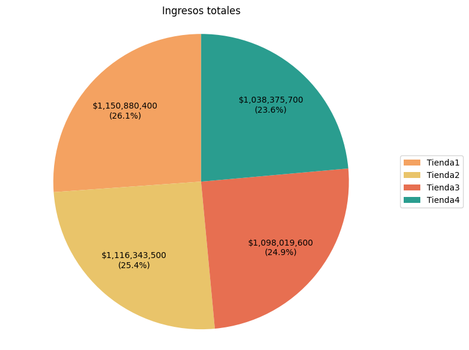

# Informe

### Descripción
En este proyecto se busca analizar el balance de las cuatro tiendas utilizando las bibliotecas `Pandas` y `Matplotlib`, con el fin de generar gráficos que permitan identificar las fortalezas y debilidades de cada una. Además, se representa la ubicación de las tiendas mediante la biblioteca `Cartopy`.

#### Objetivo 
El objetivo es identificar la tienda con los balances más bajos para recomendar al señor Juan cuál debería vender e invertir así en un nuevo negocio.

---

Fig.1.Propia (La imagen muestra el total de los ingresos de las diversas tiendas con un porcentaje basado en el 100%)

Como se puede observar en la imagen, la tienda con menores ingresos es la número 4, con un total de $1,038,375.70. Para este análisis, sería la tienda opcional para que el señor Juan realice sus ventas. Para obtener estos resultados, se sumaron los valores de la columna "Precios" con el fin de calcular los ingresos de todas las tiendas.
